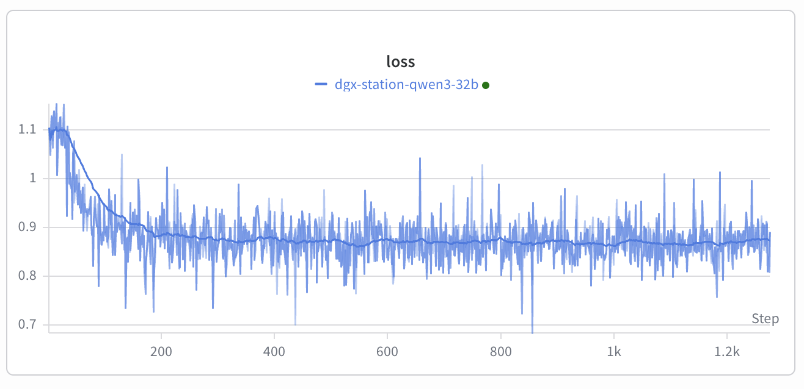
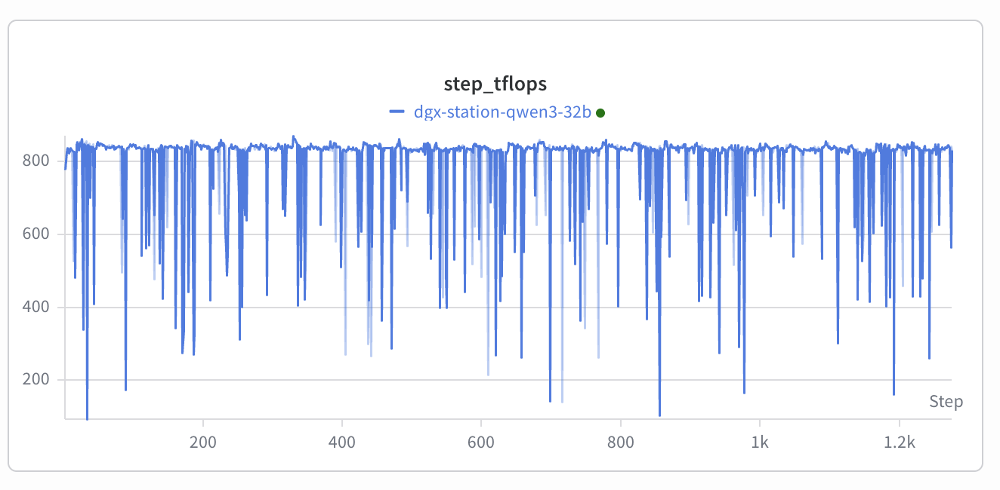
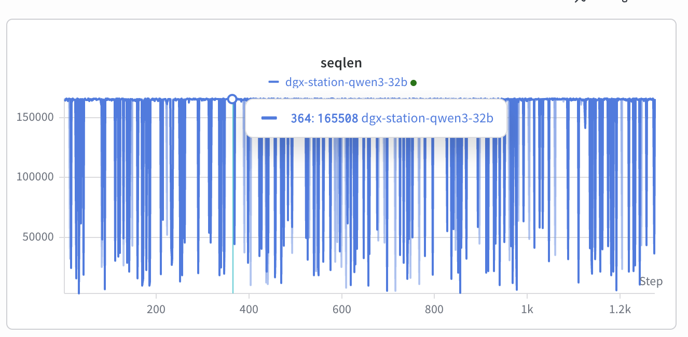
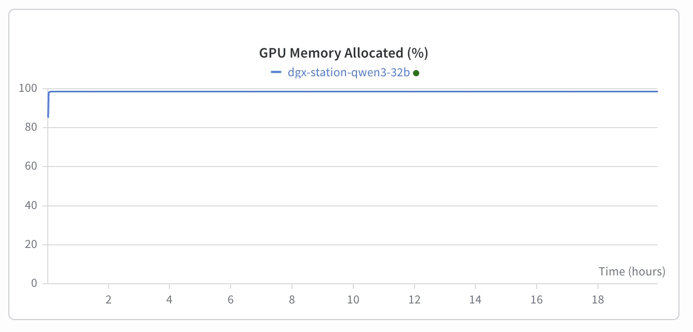

# Post-training Qwen3-32B model on 1x NVIDIA DGX Station with 166K sequence length is now a reality

Take 1x NVIDIA DGX Station (1x B300), bring in a Qwen3-32B model, use TiledMLP from [Arctic Long Sequence Training](https://arxiv.org/abs/2506.13996) and [Liger-Kernel](https://github.com/linkedin/Liger-Kernel), enable the [BF16 optimizer](news/qwen3-32b-sl166k-dgx-station.md) with offload in DeepSpeed, top it off with `export PYTORCH_ALLOC_CONF=expandable_segments:True` and voila we can now train a 166k sequence length SFT recipes. This is a single B300 GPU with some CPU memory to help.

Here is the ArcticTraining recipe [launcher](qwen3-32b-sl166k-dgx-station/run-qwen3-32b.sh) + [yml](qwen3-32b-sl166k-dgx-station/run-qwen3-32b.yml) to reproduce the results.

## Plots and Notes

We can see a nice fast convergence with [HuggingFaceH4/ultrachat_200k dataset](https://huggingface.co/datasets/HuggingFaceH4/ultrachat_200k) - though I was told some workloads struggle with the bf16 optimizer:

We used bf16 rather than mixed precision, because instead of using 12 bytes per parameters (8 bytes optim + 4 bytes master weights), we no need only 6 - (4 bytes optim + 2 bytes master weights), so a lot less memory is needed.

The flops aren't very high because we are using FA2 on Blackwell, which is very slow. Also the actual tflops are higher since TiledMLP adds an additional forward path but yours truly hasn't fixed the flop estimator to account for it ;) But even with under-reporting it's pretty good - theoretical BF16 on B400 is 2250 TFLOPS, but [measured MAMF](https://github.com/stas00/ml-engineering/tree/master/compute/accelerator#maximum-achievable-flops) is only 1769 TFLOPS  - still this pretty good.


Sequence length of each batch is comprosed from packing together smaller samples so the total sequence length varies a bit from step to step:


You can see the GPU memory is packed to the brim, but it's very stable - won't OOM:


TiledMLP and Liger-Kernel dramatically reduce memory usage and `PYTORCH_ALLOC_CONF=expandable_segments:True` helps to avoid fragmentation. [The Arctic Long Sequence Training paper](https://arxiv.org/abs/2506.13996) provides detailed insights to why you want to use these in your workloads.

## Setup

DGX Station is comprised of 1x NVIDIA B300 GPU with 288GB HBM memory and 1x Grace CPU with 495GB RAM.

Since this recipe offloads optimizer states to CPU memory it's critical to disable the NUMA mode and switch to CDMM mode as explained [here](https://developer.nvidia.com/blog/understanding-memory-management-on-hardware-coherent-platforms/). Otherwise, Linux will be stealing memory from the GPU and use it as CPU memory, leading to a much more limited capabilities - shorter possible sequence length in our use case. This is done by running:

```
$ echo options nvidia NVreg_CoherentGPUMemoryMode=driver | sudo tee /etc/modprobe.d/nvidia-openrm.conf
```
and rebooting the machine. When the system is back test it's set correctly:
```
$ grep Coherent /proc/driver/nvidia/params
CoherentGPUMemoryMode: "driver"
```
If it's not so, please refer to the CDMM article I linked to earlier.
